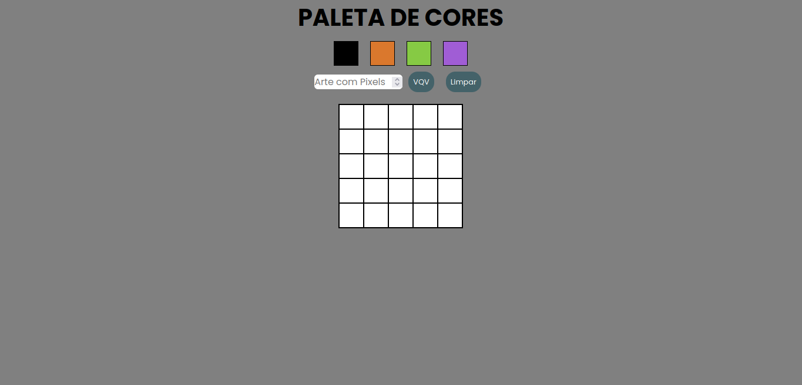

## Boas vindas ao repositório do projeto Arte com Pixels!

### Veja a aplicação em: https://pixel-art-taupe.vercel.app/

## Sumário

- [Habilidades](#habilidades)
- [Entregáveis](#entregáveis)
  - [O que foi desenvolvido](#o-que-deverá-ser-desenvolvido)
  - [Desenvolvimento](#desenvolvimento)

## Habilidades

- Manipular o DOM

- Manipular o Javascript

- CSS

---

# Entregáveis

## O que foi desenvolvido

- Uma página web que contém uma paleta de cores funcional que pode ser utilizada para criar desenhos em pixels. Para isto foi utilizado `javascript`, `CSS` e `html`.

---

## Desenvolvimento

- Implementar uma paleta de cores usando `javascript`, `css` e `html`.

## Durante o desenvolvimento

  * [Javascript.com](http://javascript.com/)

  * [W3Schools](https://www.w3schools.com/js/default.asp)

  * [MDN](https://developer.mozilla.org/pt-BR/docs/Web/JavaScript)

  * [StackOverflow](https://pt.stackoverflow.com/questions/tagged/javascript)